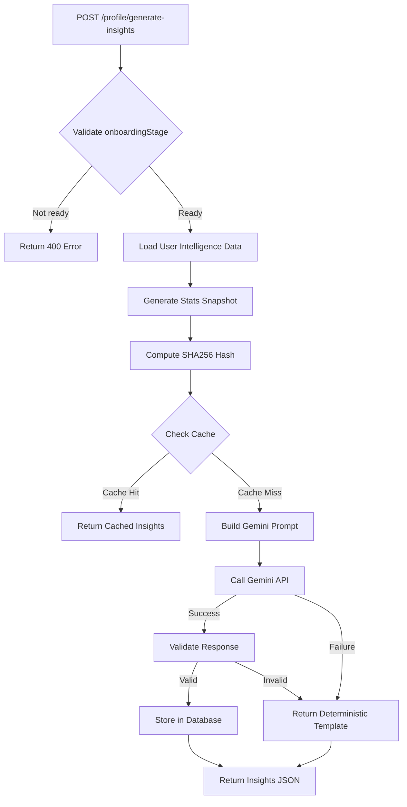
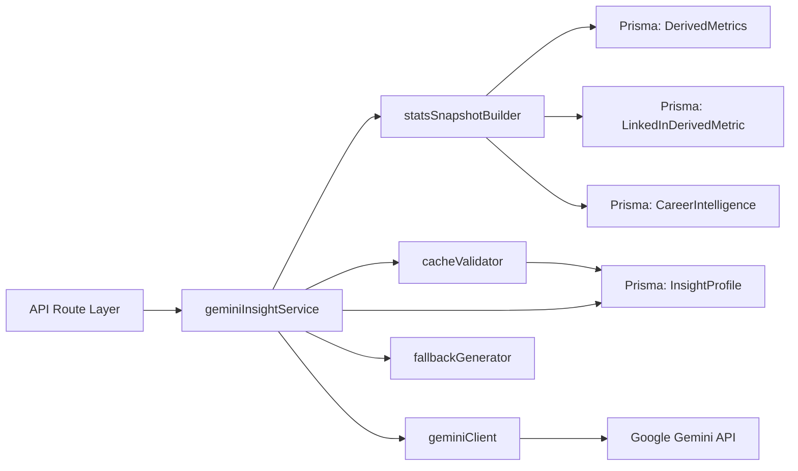
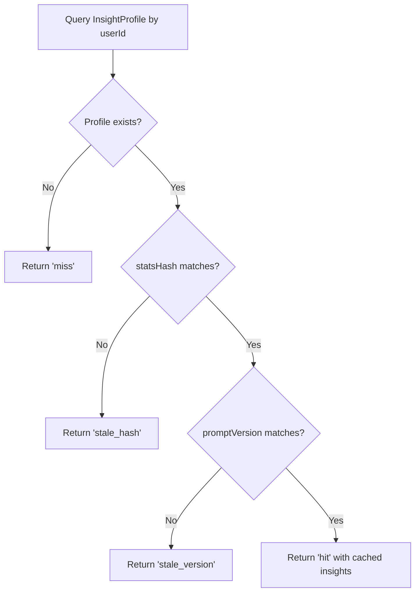

# Design Document: Gemini Insight Generation + Caching Service

## Overview

The Gemini Insight Generation service provides human-readable career insights by transforming derived intelligence metrics into natural language summaries. The system implements intelligent caching to minimize API costs while maintaining insight freshness through version-aware cache invalidation.

### Key Design Principles

- **Cost Efficiency**: Cache-first architecture prevents redundant API calls
- **Version Awareness**: Automatic cache invalidation when prompts or models change
- **Graceful Degradation**: Deterministic fallbacks ensure system reliability
- **Security First**: API keys isolated in environment, minimal logging of sensitive data
- **Compact Data Transfer**: Stats snapshots limited to 2KB for optimal API performance

### System Context

This service integrates with the existing 10-layer career intelligence architecture:
- Consumes: DerivedMetrics (Layer 5), LinkedInDerivedMetric, CareerIntelligence (Layer 6)
- Produces: InsightProfile with 8 human-readable insight sections
- Triggers: On-demand via POST /profile/generate-insights (requires onboardingStage="intelligence_ready")

## Architecture

### High-Level Data Flow




### Service Layer Architecture



### Component Responsibilities

**geminiInsightService** (Orchestrator)
- Validates user onboarding stage
- Coordinates cache validation and insight generation
- Handles error recovery with deterministic fallbacks
- Manages database persistence

**statsSnapshotBuilder**
- Fetches latest intelligence data from multiple sources
- Extracts only required fields (11 specific metrics)
- Enforces 2KB size limit
- Generates SHA256 hash for cache validation

**cacheValidator**
- Queries existing InsightProfile by userId
- Compares statsHash and promptVersion
- Returns cache decision (hit/miss/stale)

**geminiClient**
- Manages Gemini API communication
- Constructs prompts with analytical tone instructions
- Validates response structure (8 required sections)
- Enforces temperature=0.3 and token limits

**fallbackGenerator**
- Provides deterministic insight templates
- Activates on API timeout, invalid JSON, or any Gemini failure
- Ensures system never returns errors to frontend


## Components and Interfaces

### Database Model: InsightProfile

```prisma
model InsightProfile {
  id            String   @id @default(uuid())
  userId        String   @unique
  user          UserAuth @relation(fields: [userId], references: [id], onDelete: Cascade)
  
  modelVersion  String   // e.g., "intelligence_v3"
  promptVersion String   // e.g., "insight_v1"
  statsHash     String   // SHA256 hash of stats snapshot
  
  insightsJson  Json     // 8 insight sections
  
  generatedAt   DateTime
  createdAt     DateTime @default(now())
  updatedAt     DateTime @updatedAt
  
  @@index([userId])
}
```

### TypeScript Interfaces

```typescript
// Stats snapshot for Gemini input
interface StatsSnapshot {
  primaryDomain: string;
  domainDistribution: Record<string, number>;
  topSkills: string[];
  ownershipIndex: number;
  engineeringDiscipline: string;
  systemComplexity: number;
  consistency: number;
  readinessScore: number;
  alignmentScore: number;
  cognitiveStyle: string;
  topProjectsSummary: string;
}

// Gemini API response structure
interface InsightJSON {
  heroSummary: string;        // 2-4 sentences: Career headline
  domainInsight: string;      // 2-4 sentences: Domain expertise analysis
  skillInsight: string;       // 2-4 sentences: Skill depth assessment
  engineeringInsight: string; // 2-4 sentences: Engineering discipline analysis
  growthInsight: string;      // 2-4 sentences: Growth trajectory
  alignmentInsight: string;   // 2-4 sentences: Career alignment assessment
  projectInsight: string;     // 2-4 sentences: Project complexity analysis
  gapInsight: string;         // 2-4 sentences: Development opportunities
}

// Cache validation result
interface CacheValidation {
  status: 'hit' | 'miss' | 'stale_hash' | 'stale_version';
  cachedInsights?: InsightJSON;
}

// Service configuration
interface InsightServiceConfig {
  PROMPT_VERSION: 'insight_v1';
  MODEL_VERSION: 'intelligence_v3';
  MAX_SNAPSHOT_BYTES: 2048;
  GEMINI_TEMPERATURE: 0.3;
  GEMINI_MAX_TOKENS: 1024;
}
```


### Service API

```typescript
// Main service interface
interface GeminiInsightService {
  /**
   * Generate or retrieve cached insights for a user
   * @throws Error if user not found or onboarding incomplete
   */
  generateInsights(userId: string): Promise<InsightJSON>;
  
  /**
   * Force regeneration (bypasses cache)
   * Used for testing or manual refresh
   */
  regenerateInsights(userId: string): Promise<InsightJSON>;
}

// Internal helper interfaces
interface StatsSnapshotBuilder {
  build(userId: string): Promise<{ snapshot: StatsSnapshot; hash: string }>;
}

interface CacheValidator {
  validate(
    userId: string, 
    statsHash: string, 
    promptVersion: string
  ): Promise<CacheValidation>;
}

interface GeminiClient {
  generateInsights(
    snapshot: StatsSnapshot, 
    prompt: string
  ): Promise<InsightJSON>;
}

interface FallbackGenerator {
  generateDeterministicInsights(snapshot: StatsSnapshot): InsightJSON;
}
```


## Data Models

### Stats Snapshot Construction

The stats snapshot aggregates data from three intelligence sources:

**From DerivedMetrics (Layer 5):**
- `ownershipIndex` (from domainModelJson.ownership)
- `engineeringDiscipline` (from projectModelJson.discipline)
- `systemComplexity` (from projectModelJson.complexity.systemComplexityGradient)
- `consistency` (from growthModelJson.consistencyStability)
- `readinessScore` (from readinessModelJson.marketReadiness.professionalReadiness)

**From LinkedInDerivedMetric:**
- `alignmentScore` (from claimConsistency field)

**From CareerIntelligence (Layer 6):**
- `primaryDomain`
- `domainDistribution`
- `topSkills` (first 8 from coreSkills array)
- `cognitiveStyle` (from cognitiveStyleModel.dominantStyle)
- `topProjectsSummary` (concatenated names from first 3 highlightProjects)

### Size Optimization Strategy

To maintain the 2KB limit:
1. Limit topSkills to 8 entries maximum
2. Limit topProjectsSummary to 3 project names (comma-separated)
3. Round numeric scores to 2 decimal places
4. Exclude all arrays, nested objects, and raw text fields
5. Use compact JSON serialization (no whitespace)

### Hash Generation

```typescript
function generateStatsHash(snapshot: StatsSnapshot): string {
  const canonical = JSON.stringify(snapshot, Object.keys(snapshot).sort());
  return crypto.createHash('sha256').update(canonical).digest('hex');
}
```

The hash uses canonical JSON (sorted keys) to ensure deterministic hashing across different serialization orders.


### Cache Validation Logic



Cache invalidation triggers:
- **Stats change**: User's intelligence data updated (new GitHub activity, LinkedIn import)
- **Prompt change**: PROMPT_VERSION constant incremented (manual deployment)
- **Model change**: MODEL_VERSION updated (intelligence pipeline upgrade)


### Gemini Prompt Template

```typescript
function buildGeminiPrompt(snapshot: StatsSnapshot): string {
  return `You are a professional career intelligence analyst. Generate concise, analytical insights from the following developer profile statistics.

PROFILE STATISTICS:
- Primary Domain: ${snapshot.primaryDomain}
- Domain Distribution: ${JSON.stringify(snapshot.domainDistribution)}
- Top Skills: ${snapshot.topSkills.join(', ')}
- Ownership Index: ${snapshot.ownershipIndex}/10
- Engineering Discipline: ${snapshot.engineeringDiscipline}
- System Complexity: ${snapshot.systemComplexity}/10
- Consistency: ${snapshot.consistency}/10
- Professional Readiness: ${snapshot.readinessScore}/10
- Alignment Score: ${snapshot.alignmentScore}/10
- Cognitive Style: ${snapshot.cognitiveStyle}
- Notable Projects: ${snapshot.topProjectsSummary}

INSTRUCTIONS:
- Use an analytical, professional tone
- Base insights ONLY on the provided statistics
- Do NOT exaggerate or hallucinate capabilities
- Do NOT use buzzwords (e.g., "rockstar", "ninja", "guru")
- Each section must be 2-4 sentences
- Be specific and evidence-based

OUTPUT FORMAT (valid JSON only, no markdown):
{
  "heroSummary": "2-4 sentence career headline summarizing primary strengths",
  "domainInsight": "2-4 sentence analysis of domain expertise and distribution",
  "skillInsight": "2-4 sentence assessment of skill depth and breadth",
  "engineeringInsight": "2-4 sentence evaluation of engineering discipline and approach",
  "growthInsight": "2-4 sentence analysis of consistency and development trajectory",
  "alignmentInsight": "2-4 sentence assessment of career alignment and focus",
  "projectInsight": "2-4 sentence evaluation of project complexity and scope",
  "gapInsight": "2-4 sentence identification of development opportunities"
}`;
}
```


## Correctness Properties

*A property is a characteristic or behavior that should hold true across all valid executions of a system—essentially, a formal statement about what the system should do. Properties serve as the bridge between human-readable specifications and machine-verifiable correctness guarantees.*

### Property 1: Stats Snapshot Content Validation

*For any* generated Stats_Snapshot, it SHALL contain exactly the 11 required fields (primaryDomain, domainDistribution, topSkills, ownershipIndex, engineeringDiscipline, systemComplexity, consistency, readinessScore, alignmentScore, cognitiveStyle, topProjectsSummary) and SHALL NOT contain raw GitHub data, commit arrays, or README text.

**Validates: Requirements 2.2, 2.3**

### Property 2: Stats Snapshot Size Limit

*For any* generated Stats_Snapshot, its JSON-stringified representation SHALL be at most 2048 bytes.

**Validates: Requirements 2.4**

### Property 3: Stats Hash Determinism

*For any* Stats_Snapshot, generating the SHA256 hash twice SHALL produce identical hash values, and the hash SHALL be a valid 64-character hexadecimal string.

**Validates: Requirements 2.5**

### Property 4: Cache Validation Logic

*For any* insight generation request, IF an InsightProfile exists with matching userId, statsHash, and promptVersion, THEN the service SHALL return the cached insightsJson without calling the Gemini API; IF either statsHash or promptVersion differs, THEN the service SHALL regenerate insights by calling the Gemini API.

**Validates: Requirements 3.2, 3.3, 3.4**

### Property 5: Prompt Content Exclusion

*For any* generated Gemini prompt, it SHALL NOT contain raw GitHub data, commit arrays, or README text—only derived statistics from the Stats_Snapshot.

**Validates: Requirements 4.6**


### Property 6: Gemini API Request Configuration

*For any* Gemini API request, the client SHALL set temperature to 0.3 and SHALL enforce a maximum token limit.

**Validates: Requirements 5.2, 5.3**

### Property 7: API Response Validation

*For any* Gemini API response, the client SHALL validate that it contains valid JSON AND that the JSON contains all 8 required insight sections (heroSummary, domainInsight, skillInsight, engineeringInsight, growthInsight, alignmentInsight, projectInsight, gapInsight).

**Validates: Requirements 5.4, 5.5**

### Property 8: Error Handling Without Exceptions

*For any* error condition (API timeout, invalid JSON, or any Gemini failure), the service SHALL return a valid InsightJSON response (either cached or deterministic template) and SHALL NOT throw unhandled exceptions.

**Validates: Requirements 6.1, 6.2, 6.4**

### Property 9: Secure Logging

*For any* error log entry, it SHALL contain only userId and statsHash, and SHALL NOT contain full prompt content (in production), API keys, or other sensitive data.

**Validates: Requirements 6.3, 10.2, 10.3, 10.4**

### Property 10: Onboarding Stage Validation

*For any* insight generation request, IF the user's onboardingStage is not "intelligence_ready", THEN the service SHALL reject the request and return an error response.

**Validates: Requirements 8.2**

### Property 11: Insight Storage Structure

*For any* stored InsightProfile, the insightsJson field SHALL be a valid JSON object containing exactly 8 string fields (heroSummary, domainInsight, skillInsight, engineeringInsight, growthInsight, alignmentInsight, projectInsight, gapInsight), and the generatedAt field SHALL be a valid timestamp.

**Validates: Requirements 9.1, 9.2, 9.3**

### Property 12: Version Persistence

*For any* created InsightProfile record, it SHALL contain non-empty modelVersion and promptVersion fields.

**Validates: Requirements 1.4**

### Property 13: Timestamp Update on Regeneration

*For any* insight regeneration, the updatedAt timestamp SHALL be more recent than the previous updatedAt value.

**Validates: Requirements 9.4**


## Error Handling

### Error Categories and Responses

**1. User Validation Errors (400 Bad Request)**
- User not found
- Onboarding stage not "intelligence_ready"
- Missing required intelligence data

Response format:
```json
{
  "success": false,
  "error": "User has not completed intelligence processing. Please run v3-derive first."
}
```

**2. Gemini API Errors (Graceful Degradation)**
- API timeout (>30s)
- Invalid API key
- Rate limit exceeded
- Invalid JSON response
- Missing required insight sections

Behavior: Return deterministic template, log error with userId + statsHash only

**3. Database Errors (500 Internal Server Error)**
- Connection failures
- Query timeouts
- Constraint violations

Behavior: Log full error server-side, return generic error to client

### Deterministic Fallback Template

```typescript
function generateDeterministicInsights(snapshot: StatsSnapshot): InsightJSON {
  return {
    heroSummary: `${snapshot.primaryDomain} specialist with focus on ${snapshot.topSkills.slice(0, 3).join(', ')}. Professional readiness score: ${snapshot.readinessScore}/10.`,
    
    domainInsight: `Primary expertise in ${snapshot.primaryDomain}. ${
      Object.keys(snapshot.domainDistribution).length > 1 
        ? 'Cross-domain experience across ' + Object.keys(snapshot.domainDistribution).join(', ') + '.'
        : 'Focused specialization in single domain.'
    }`,
    
    skillInsight: `Core technical skills include ${snapshot.topSkills.slice(0, 5).join(', ')}. Skill depth indicates ${
      snapshot.ownershipIndex >= 7 ? 'strong' : snapshot.ownershipIndex >= 4 ? 'moderate' : 'developing'
    } ownership patterns.`,
    
    engineeringInsight: `Engineering discipline: ${snapshot.engineeringDiscipline}. System complexity score of ${snapshot.systemComplexity}/10 indicates ${
      snapshot.systemComplexity >= 7 ? 'advanced' : snapshot.systemComplexity >= 4 ? 'intermediate' : 'foundational'
    } architectural experience.`,
    
    growthInsight: `Consistency score: ${snapshot.consistency}/10. ${
      snapshot.consistency >= 7 ? 'Demonstrates sustained development activity.' : 'Development patterns show room for increased consistency.'
    }`,
    
    alignmentInsight: `Career alignment score: ${snapshot.alignmentScore}/10. ${
      snapshot.alignmentScore >= 7 ? 'Strong alignment between stated expertise and demonstrated work.' : 'Opportunities exist to strengthen alignment between claims and evidence.'
    }`,
    
    projectInsight: `Notable projects: ${snapshot.topProjectsSummary}. Cognitive style: ${snapshot.cognitiveStyle}.`,
    
    gapInsight: `Professional readiness: ${snapshot.readinessScore}/10. ${
      snapshot.readinessScore >= 7 ? 'Well-positioned for senior roles.' : 'Focus on increasing project complexity and consistency to advance career trajectory.'
    }`
  };
}
```


### Logging Strategy

**Development Environment:**
```typescript
console.log('[Insight Service] Generating insights for user:', userId);
console.log('[Insight Service] Stats snapshot:', snapshot);
console.log('[Insight Service] Gemini prompt:', prompt);
console.log('[Insight Service] API response:', response);
```

**Production Environment:**
```typescript
console.log('[Insight Service] Generating insights', { userId, statsHash });
console.error('[Insight Service] Gemini API error', { 
  userId, 
  statsHash, 
  errorType: err.name,
  message: err.message 
});
// Never log: full prompt, API key, full snapshot, raw intelligence data
```

### Retry Strategy

No automatic retries for Gemini API calls:
- Rationale: Each call costs money; failed calls should use deterministic fallback
- Manual retry: Frontend can call endpoint again if user requests
- Rate limiting: Implement at API route level (max 5 requests per user per hour)


## Testing Strategy

### Dual Testing Approach

This feature requires both unit tests and property-based tests for comprehensive coverage:

**Unit Tests** focus on:
- Specific examples of cache hit/miss scenarios
- Error handling for specific failure modes (timeout, invalid JSON)
- API endpoint behavior with different onboarding stages
- Deterministic fallback template generation

**Property-Based Tests** focus on:
- Stats snapshot generation across all possible intelligence data combinations
- Cache validation logic across all possible hash/version combinations
- Prompt construction never includes raw data regardless of input
- Response validation for all possible Gemini outputs
- Secure logging across all error conditions

### Property-Based Testing Configuration

**Framework**: fast-check (TypeScript property-based testing library)

**Configuration**:
- Minimum 100 iterations per property test
- Each test tagged with feature name and property number
- Tag format: `Feature: gemini-insight-generation, Property {N}: {description}`

**Example Test Structure**:
```typescript
import fc from 'fast-check';

describe('Feature: gemini-insight-generation, Property 1: Stats Snapshot Content Validation', () => {
  it('should contain exactly 11 required fields and exclude raw data', async () => {
    await fc.assert(
      fc.asyncProperty(
        arbitraryIntelligenceData(),
        async (intelligenceData) => {
          const { snapshot } = await buildStatsSnapshot(intelligenceData);
          
          // Verify exactly 11 fields
          const fields = Object.keys(snapshot);
          expect(fields).toHaveLength(11);
          expect(fields).toEqual(expect.arrayContaining([
            'primaryDomain', 'domainDistribution', 'topSkills',
            'ownershipIndex', 'engineeringDiscipline', 'systemComplexity',
            'consistency', 'readinessScore', 'alignmentScore',
            'cognitiveStyle', 'topProjectsSummary'
          ]));
          
          // Verify no raw data
          const snapshotStr = JSON.stringify(snapshot);
          expect(snapshotStr).not.toContain('commit');
          expect(snapshotStr).not.toContain('README');
          expect(snapshotStr).not.toContain('rawRepoJson');
        }
      ),
      { numRuns: 100 }
    );
  });
});
```


### Unit Test Coverage

**Service Layer Tests** (`geminiInsightService.test.ts`):
- ✓ Rejects requests when onboardingStage != "intelligence_ready"
- ✓ Returns cached insights on cache hit
- ✓ Regenerates insights when statsHash changes
- ✓ Regenerates insights when promptVersion changes
- ✓ Generates new insights when no cache exists
- ✓ Returns deterministic template on Gemini timeout
- ✓ Returns deterministic template on invalid JSON response
- ✓ Never throws unhandled exceptions

**Stats Snapshot Tests** (`statsSnapshotBuilder.test.ts`):
- ✓ Includes all 11 required fields
- ✓ Excludes raw GitHub data
- ✓ Respects 2KB size limit
- ✓ Generates valid SHA256 hash
- ✓ Hash is deterministic for same input

**Cache Validator Tests** (`cacheValidator.test.ts`):
- ✓ Returns 'hit' when all match
- ✓ Returns 'stale_hash' when statsHash differs
- ✓ Returns 'stale_version' when promptVersion differs
- ✓ Returns 'miss' when no profile exists

**Gemini Client Tests** (`geminiClient.test.ts`):
- ✓ Reads API key from environment
- ✓ Sets temperature to 0.3
- ✓ Enforces max token limit
- ✓ Validates response is valid JSON
- ✓ Validates response contains all 8 sections
- ✓ Throws on missing sections

**API Route Tests** (`profile.test.ts`):
- ✓ POST /profile/generate-insights returns 400 if not ready
- ✓ POST /profile/generate-insights returns 200 with insights
- ✓ Response contains all 8 insight sections
- ✓ Stores insights in database

### Integration Tests

**End-to-End Flow**:
1. Create user with complete intelligence data
2. Call POST /profile/generate-insights
3. Verify insights generated and cached
4. Call again, verify cache hit (no Gemini call)
5. Update intelligence data
6. Call again, verify cache miss and regeneration

**Gemini API Mock**:
```typescript
const mockGeminiResponse = {
  heroSummary: "Test hero summary with 2-4 sentences.",
  domainInsight: "Test domain insight with analytical tone.",
  skillInsight: "Test skill assessment based on data.",
  engineeringInsight: "Test engineering evaluation.",
  growthInsight: "Test growth trajectory analysis.",
  alignmentInsight: "Test alignment assessment.",
  projectInsight: "Test project complexity evaluation.",
  gapInsight: "Test development opportunities."
};
```


## Security Considerations

### API Key Management

**Environment Variable Configuration**:
```bash
# .env
GEMINI_API_KEY=your_api_key_here
```

**Access Pattern**:
```typescript
// backend/src/config/env.ts
export const env = {
  // ... existing config
  GEMINI_API_KEY: process.env.GEMINI_API_KEY || "",
} as const;

// backend/src/services/geminiInsight/geminiClient.ts
import { env } from '../../config/env.js';

const apiKey = env.GEMINI_API_KEY;
if (!apiKey) {
  throw new Error('GEMINI_API_KEY not configured');
}
```

**Security Rules**:
1. Never log API key in any environment
2. Never include API key in error messages or responses
3. Never commit API key to version control
4. Use separate keys for development and production
5. Rotate keys quarterly or on suspected compromise

### Data Privacy

**Minimal Data Exposure**:
- Stats snapshot contains only aggregated metrics (no raw commits, READMEs, or personal data)
- Gemini prompts contain only derived statistics
- Logs contain only userId and statsHash (no PII)

**Database Security**:
- InsightProfile.insightsJson contains only generated text (no source data)
- Cascade delete on user deletion (GDPR compliance)
- No cross-user data leakage (unique constraint on userId)

### Rate Limiting

Implement at API route level to prevent abuse:
```typescript
// Pseudo-code for rate limiting
const RATE_LIMIT = {
  maxRequests: 5,
  windowMs: 60 * 60 * 1000, // 1 hour
};

// Track requests per user
const requestCounts = new Map<string, { count: number; resetAt: number }>();
```

### Input Validation

**User Input Sanitization**:
- userId validated as UUID format
- No user-provided content in Gemini prompts
- All stats snapshot fields type-validated before API call

**Output Sanitization**:
- Gemini responses validated for structure before storage
- HTML/script tags stripped from insight text (if any)
- Maximum length enforced per insight section (500 chars)


## Implementation Details

### File Structure

```
backend/src/services/geminiInsight/
├── index.ts                      # Main service orchestrator
├── statsSnapshotBuilder.ts       # Stats snapshot generation
├── cacheValidator.ts             # Cache validation logic
├── geminiClient.ts               # Gemini API client
├── promptBuilder.ts              # Prompt template construction
├── fallbackGenerator.ts          # Deterministic template
├── types.ts                      # TypeScript interfaces
└── __tests__/
    ├── geminiInsightService.test.ts
    ├── statsSnapshotBuilder.test.ts
    ├── cacheValidator.test.ts
    ├── geminiClient.test.ts
    └── integration.test.ts

backend/src/routes/
└── profile.ts                    # Add POST /generate-insights endpoint

backend/prisma/
└── schema.prisma                 # Add InsightProfile model
```

### Service Implementation Outline

**index.ts** (Main Orchestrator):
```typescript
export async function generateInsights(userId: string): Promise<InsightJSON> {
  // 1. Validate onboarding stage
  const user = await prisma.userAuth.findUnique({ where: { id: userId } });
  if (user.onboardingStage !== 'intelligence_ready') {
    throw new Error('User not ready for insight generation');
  }
  
  // 2. Build stats snapshot
  const { snapshot, hash } = await buildStatsSnapshot(userId);
  
  // 3. Check cache
  const cache = await validateCache(userId, hash, PROMPT_VERSION);
  if (cache.status === 'hit') {
    return cache.cachedInsights!;
  }
  
  // 4. Generate insights (with fallback)
  let insights: InsightJSON;
  try {
    const prompt = buildGeminiPrompt(snapshot);
    insights = await callGeminiAPI(snapshot, prompt);
  } catch (err) {
    console.error('[Insight Service] Gemini failed, using fallback', { 
      userId, 
      statsHash: hash 
    });
    insights = generateDeterministicInsights(snapshot);
  }
  
  // 5. Store in database
  await prisma.insightProfile.upsert({
    where: { userId },
    create: {
      userId,
      modelVersion: MODEL_VERSION,
      promptVersion: PROMPT_VERSION,
      statsHash: hash,
      insightsJson: insights,
      generatedAt: new Date(),
    },
    update: {
      modelVersion: MODEL_VERSION,
      promptVersion: PROMPT_VERSION,
      statsHash: hash,
      insightsJson: insights,
      generatedAt: new Date(),
    },
  });
  
  return insights;
}
```


**statsSnapshotBuilder.ts**:
```typescript
export async function buildStatsSnapshot(
  userId: string
): Promise<{ snapshot: StatsSnapshot; hash: string }> {
  // Fetch latest intelligence data
  const [derived, linkedinDerived, intelligence] = await Promise.all([
    prisma.derivedMetrics.findFirst({
      where: { userId },
      orderBy: { computedAt: 'desc' },
    }),
    prisma.linkedInDerivedMetric.findFirst({
      where: { userId },
      orderBy: { computedAt: 'desc' },
    }),
    prisma.careerIntelligence.findFirst({
      where: { userId },
      orderBy: { generatedAt: 'desc' },
    }),
  ]);
  
  if (!derived || !intelligence) {
    throw new Error('Required intelligence data not found');
  }
  
  // Extract fields from JSON columns
  const domainModel = derived.domainModelJson as any;
  const projectModel = derived.projectModelJson as any;
  const growthModel = derived.growthModelJson as any;
  const readinessModel = derived.readinessModelJson as any;
  const intelligenceData = intelligence.intelligenceJson as any;
  
  // Build compact snapshot
  const snapshot: StatsSnapshot = {
    primaryDomain: intelligenceData.primaryDomain || 'Unknown',
    domainDistribution: intelligenceData.domainDistribution || {},
    topSkills: (intelligenceData.coreSkills || []).slice(0, 8),
    ownershipIndex: Math.round((domainModel?.ownership?.ownershipIndex || 0) * 100) / 100,
    engineeringDiscipline: projectModel?.discipline?.engineeringDiscipline || 'Unknown',
    systemComplexity: Math.round((projectModel?.complexity?.systemComplexityGradient || 0) * 100) / 100,
    consistency: Math.round((growthModel?.consistencyStability || 0) * 100) / 100,
    readinessScore: Math.round((readinessModel?.marketReadiness?.professionalReadiness || 0) * 100) / 100,
    alignmentScore: Math.round((linkedinDerived?.claimConsistency || 0) * 100) / 100,
    cognitiveStyle: intelligenceData.cognitiveStyleModel?.dominantStyle || 'Unknown',
    topProjectsSummary: (intelligenceData.highlightProjects || [])
      .slice(0, 3)
      .map((p: any) => p.name)
      .join(', '),
  };
  
  // Verify size limit
  const snapshotStr = JSON.stringify(snapshot);
  if (snapshotStr.length > MAX_SNAPSHOT_BYTES) {
    throw new Error(`Stats snapshot exceeds ${MAX_SNAPSHOT_BYTES} bytes`);
  }
  
  // Generate hash
  const hash = crypto
    .createHash('sha256')
    .update(JSON.stringify(snapshot, Object.keys(snapshot).sort()))
    .digest('hex');
  
  return { snapshot, hash };
}
```


**geminiClient.ts**:
```typescript
import { GoogleGenerativeAI } from '@google/generative-ai';
import { env } from '../../config/env.js';

export async function callGeminiAPI(
  snapshot: StatsSnapshot,
  prompt: string
): Promise<InsightJSON> {
  const apiKey = env.GEMINI_API_KEY;
  if (!apiKey) {
    throw new Error('GEMINI_API_KEY not configured');
  }
  
  const genAI = new GoogleGenerativeAI(apiKey);
  const model = genAI.getGenerativeModel({ 
    model: 'gemini-2.0-flash',
    generationConfig: {
      temperature: GEMINI_TEMPERATURE,
      maxOutputTokens: GEMINI_MAX_TOKENS,
    },
  });
  
  const result = await model.generateContent(prompt);
  let text = result.response.text().trim();
  
  // Strip markdown code fences if present
  text = text.replace(/^```(?:json)?\s*\n?/i, '').replace(/\n?```\s*$/i, '');
  
  // Parse and validate
  let insights: InsightJSON;
  try {
    insights = JSON.parse(text);
  } catch (err) {
    throw new Error('Gemini returned invalid JSON');
  }
  
  // Validate all 8 sections present
  const required = [
    'heroSummary', 'domainInsight', 'skillInsight', 'engineeringInsight',
    'growthInsight', 'alignmentInsight', 'projectInsight', 'gapInsight'
  ];
  
  for (const field of required) {
    if (typeof insights[field] !== 'string' || !insights[field]) {
      throw new Error(`Missing or invalid field: ${field}`);
    }
  }
  
  return insights;
}
```

**API Route** (profile.ts):
```typescript
router.post(
  '/generate-insights',
  requireAuth,
  async (req: AuthRequest, res: Response) => {
    try {
      if (!req.userId) {
        return res.status(401).json({ error: 'User not authenticated' });
      }
      
      const insights = await generateInsights(req.userId);
      
      return res.json({
        success: true,
        message: 'Insights generated successfully',
        data: { insights },
      });
    } catch (err) {
      console.error('[Profile Route] Insight generation failed:', err);
      
      const message = err instanceof Error ? err.message : 'Failed to generate insights';
      const status = message.includes('not ready') ? 400 : 500;
      
      return res.status(status).json({
        success: false,
        error: message,
      });
    }
  }
);
```


## Database Migration

### Prisma Schema Addition

```prisma
model InsightProfile {
  id            String   @id @default(uuid())
  userId        String   @unique
  user          UserAuth @relation(fields: [userId], references: [id], onDelete: Cascade)
  
  modelVersion  String   // "intelligence_v3"
  promptVersion String   // "insight_v1"
  statsHash     String   // SHA256 hash
  
  insightsJson  Json     // 8 insight sections
  
  generatedAt   DateTime
  createdAt     DateTime @default(now())
  updatedAt     DateTime @updatedAt
  
  @@index([userId])
}
```

### Migration Steps

1. Add InsightProfile model to schema.prisma
2. Add relation to UserAuth model:
   ```prisma
   model UserAuth {
     // ... existing fields
     insightProfile InsightProfile?
   }
   ```
3. Generate migration: `npx prisma migrate dev --name add-insight-profile`
4. Apply to production: `npx prisma migrate deploy`

### Rollback Plan

If issues arise:
1. Remove InsightProfile relation from UserAuth
2. Drop InsightProfile table
3. Revert migration: `npx prisma migrate resolve --rolled-back {migration_name}`

No data loss risk since this is a new feature with no existing data.


## Performance Considerations

### Caching Strategy Impact

**Expected Cache Hit Rate**: 80-90% after initial generation
- Users typically don't update GitHub/LinkedIn data frequently
- Prompt version changes are infrequent (quarterly at most)
- Model version changes tied to major intelligence pipeline updates

**Cost Savings**:
- Without cache: ~$0.001 per request × 1000 users × 10 requests/month = $10/month
- With 85% cache hit rate: ~$0.001 × 1000 × 10 × 0.15 = $1.50/month
- Savings: 85% reduction in API costs

### Database Query Optimization

**Index Strategy**:
- Primary index on `userId` (unique constraint)
- No additional indexes needed (single-user queries only)

**Query Performance**:
- Cache lookup: Single indexed query (~1ms)
- Stats snapshot build: 3 parallel queries (~10-20ms)
- Total overhead: ~20-30ms (negligible compared to Gemini API latency)

### Gemini API Performance

**Expected Latency**:
- Gemini 2.0 Flash: 2-5 seconds for 1024 tokens
- Network overhead: 100-500ms
- Total: 2.5-5.5 seconds per generation

**Timeout Configuration**:
- Set timeout to 30 seconds (generous buffer)
- Fallback activates if exceeded

### Snapshot Size Optimization

**Current Size Analysis**:
```
primaryDomain: ~20 bytes
domainDistribution: ~100 bytes (5 domains × 20 bytes each)
topSkills: ~200 bytes (8 skills × 25 bytes each)
numeric fields (8): ~80 bytes
cognitiveStyle: ~30 bytes
topProjectsSummary: ~150 bytes
Total: ~580 bytes (well under 2KB limit)
```

**Growth Headroom**: 3.5× current size before hitting limit


## Deployment Considerations

### Environment Variables

**Required**:
```bash
GEMINI_API_KEY=your_production_key_here
```

**Optional** (with defaults):
```bash
NODE_ENV=production  # Controls logging verbosity
```

### Deployment Checklist

1. ✓ Add GEMINI_API_KEY to production environment
2. ✓ Run database migration (add InsightProfile table)
3. ✓ Deploy backend service with new route
4. ✓ Verify API key is not logged in production
5. ✓ Test cache hit/miss scenarios in staging
6. ✓ Monitor Gemini API usage and costs
7. ✓ Set up alerts for API failures (>10% error rate)

### Monitoring and Observability

**Key Metrics**:
- Cache hit rate (target: >80%)
- Gemini API latency (target: <5s p95)
- Gemini API error rate (target: <5%)
- Fallback activation rate (target: <10%)
- Insight generation requests per user per day

**Logging**:
```typescript
// Production logs (structured JSON)
{
  "timestamp": "2024-01-15T10:30:00Z",
  "level": "info",
  "service": "insight-generation",
  "userId": "uuid",
  "statsHash": "sha256",
  "cacheStatus": "hit|miss|stale",
  "duration": 2500,
  "success": true
}
```

**Alerts**:
- Gemini API error rate >10% for 5 minutes
- Cache hit rate <70% for 1 hour
- Average latency >10s for 5 minutes
- Fallback activation rate >20% for 10 minutes


## Future Enhancements

### Phase 2 Considerations

**Multi-Language Support**:
- Add `language` field to InsightProfile
- Modify prompt to specify output language
- Invalidate cache when user changes language preference

**Insight Versioning**:
- Store historical insights (add `version` field)
- Allow users to view insight evolution over time
- Compare insights across different time periods

**Custom Insight Sections**:
- Allow users to request specific insight types
- Add `requestedSections` parameter to API
- Generate only requested sections (cost optimization)

**Batch Generation**:
- Admin endpoint to regenerate insights for all users
- Useful after prompt version updates
- Background job with rate limiting

**A/B Testing**:
- Multiple prompt versions running simultaneously
- Track user engagement with different insight styles
- Automatically promote best-performing prompts

### Scalability Considerations

**Current Design Limits**:
- Single Gemini API key (rate limit: 60 requests/minute)
- Synchronous generation (blocks request until complete)
- No distributed caching

**Future Optimizations**:
- Multiple API keys with load balancing
- Async generation with webhook notification
- Redis cache layer for multi-instance deployments
- Pre-generation for active users (predictive caching)


## Appendix

### Glossary Reference

- **Insight_Service**: The geminiInsightService orchestrator module
- **Stats_Snapshot**: StatsSnapshot TypeScript interface (11 fields)
- **Stats_Hash**: SHA256 hash generated by statsSnapshotBuilder
- **Insight_Profile**: InsightProfile Prisma model
- **Gemini_Client**: geminiClient.ts module wrapping Google Generative AI SDK
- **Prompt_Version**: Constant "insight_v1" in service config
- **Model_Version**: Constant "intelligence_v3" in service config
- **Insight_JSON**: InsightJSON TypeScript interface (8 sections)

### API Response Examples

**Success Response (200)**:
```json
{
  "success": true,
  "message": "Insights generated successfully",
  "data": {
    "insights": {
      "heroSummary": "Full-stack developer specializing in web development with 7 years of experience. Strong focus on React.js, Node.js, and TypeScript with demonstrated ownership patterns.",
      "domainInsight": "Primary expertise in web development with 65% focus. Secondary experience in cloud infrastructure (20%) and data engineering (15%) indicates versatile technical background.",
      "skillInsight": "Core technical competencies include React.js, TypeScript, Node.js, PostgreSQL, and AWS. Ownership index of 7.8/10 suggests strong code ownership and architectural decision-making.",
      "engineeringInsight": "Engineering discipline: Full-Stack Generalist. System complexity score of 6.5/10 indicates experience with moderately complex distributed systems and microservices architectures.",
      "growthInsight": "Consistency score of 8.2/10 demonstrates sustained development activity over time. Growth trajectory shows steady skill expansion and increasing project complexity.",
      "alignmentInsight": "Career alignment score of 7.5/10 indicates strong coherence between stated expertise and demonstrated work. LinkedIn claims align well with GitHub contributions.",
      "projectInsight": "Notable projects include E-commerce Platform, Real-time Analytics Dashboard, and API Gateway Service. Cognitive style: Systematic Builder with balanced frontend/backend focus.",
      "gapInsight": "Professional readiness: 7.8/10. Well-positioned for senior engineering roles. Consider deepening expertise in system design and mentoring to advance toward staff/principal levels."
    }
  }
}
```

**Error Response (400)**:
```json
{
  "success": false,
  "error": "User has not completed intelligence processing. Please run v3-derive first."
}
```

**Error Response (500)**:
```json
{
  "success": false,
  "error": "Failed to generate insights"
}
```

### Version History

- **insight_v1** (Initial): 8-section analytical insights with 2-4 sentences each
- **intelligence_v3**: Current intelligence model version from 10-layer architecture

