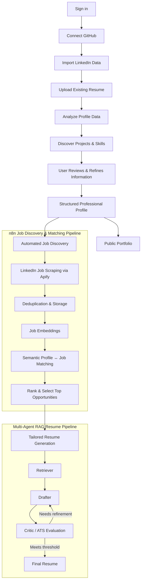
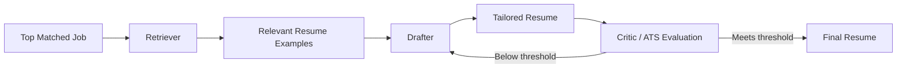

# PlaceMates

An AI-powered placement platform that helps students build, understand, and tailor their professional profiles using their real projects, experience, and skill data.

> **Your profile should represent what you have actually done — and what you can confidently explain.**

---

## Problem

Students often struggle to turn their actual work into a clear and authentic professional profile.

Their information is scattered across GitHub, LinkedIn, existing resumes, project documentation, and other sources. Important work can remain hidden, while creating resumes for different opportunities often involves manually rewriting the same information again and again.

There is another important problem with automated resume generation: an AI system may discover something from a student's repository and turn it into a polished resume statement, but the student may not fully understand or remember that detail. If it appears on the resume, they may later be asked about it in an interview.

Therefore, the goal is not simply to generate more resume content. The system should help students:

- Discover relevant information from the work they have already done.
- Understand what each part of their professional profile represents.
- Validate and refine project and skill information before using it.
- Build a profile based on their actual experience.
- Tailor that profile and resume for relevant job opportunities.

---

## Solution

**PlaceMates** brings a student's professional information together and uses AI, semantic analysis, and workflow automation to build a structured profile and connect it with relevant opportunities.

The platform analyzes sources such as GitHub repositories, LinkedIn data, and an existing resume to identify projects, skills, experience, and other relevant information.

Instead of treating discovered information as automatically valid, PlaceMates gives the user control over the profile-building process. Project information can be refined through guided input and validation so that the final profile reflects work the student can actually understand and discuss.

Once the profile is built, the platform follows a clear flow:

- **Build the profile** from the student's real projects, skills, and experience.
- **Discover job opportunities** through an automated n8n workflow.
- **Semantically match and rank jobs** against the student's profile using SentenceTransformers and FAISS.
- **Select the top-matched opportunities** for personalized application preparation.
- **Generate tailored resumes** using a multi-agent RAG pipeline and multi-LLM orchestration.

The result is a profile and application workflow grounded in the student's actual work rather than generic or automatically invented experience.

---

## Key Features

| Feature | Description |
|---|---|
| **GitHub Analysis** | Fetches repositories, analyzes commits, READMEs, file structure, languages, and project information to identify relevant projects and skills. |
| **LinkedIn Import** | Parses a LinkedIn data export and extracts positions, skills, education, awards, and certifications. |
| **Resume Upload & Extraction** | Uploads an existing PDF resume and extracts structured profile information. |
| **Profile Building** | Combines information from multiple sources into a structured professional profile. |
| **Project Discovery & Refinement** | Identifies useful project information and allows the user to refine it through guided input before using it in profile content. |
| **Automated Job Discovery** | Uses n8n workflows to scrape and collect relevant job opportunities, with deduplication and storage. |
| **Semantic Job Matching** | Uses SentenceTransformers and FAISS to compare job descriptions with student profiles and rank relevant opportunities. |
| **Top Opportunity Selection** | Selects the highest-matching opportunities for personalized application preparation. |
| **Multi-Agent RAG Resume Pipeline** | Retriever → Drafter → Critic workflow that retrieves relevant resume examples, generates tailored content, evaluates it, and iteratively refines it. |
| **Multi-LLM Model Router** | Supports Groq, Gemini, OpenAI, Cerebras, Together.ai, and Ollama with provider routing and fallback support. |
| **n8n Workflow Automation** | Orchestrates job discovery, matching, top-opportunity selection, and triggering of tailored resume generation. |
| **Portfolio Generator** | Creates a public portfolio page containing selected projects, profile information, and contact links. |
| **Resume Studio** | Provides an in-browser resume editor with template selection and live preview. |
| **Profile Insights** | Provides skill distribution, domain breakdown, project statistics, experience level, and profile strength information. |
| **Self-Improving Dataset** | Stores sufficiently high-scoring and diverse generated resumes back into the resume corpus. |
| **Ablation & Evaluation** | Includes research-oriented evaluation controls for studying the contribution of RAG, critic, and iterative refinement components. |

---

## How It Works



### Architecture

PlaceMates is organized as a multi-service application:

```text
Next.js Frontend
       ↕
Express Backend
       ↕
┌───────────────────────┐
│ PostgreSQL / Prisma   │
│ LLM Providers         │
│ GitHub / LinkedIn     │
│ Cloudinary            │
└───────────────────────┘
       ↕
FastAPI Embedding Service
       ↕
FAISS + ChromaDB
       ↕
n8n
       ↕
Apify → Job Discovery → Semantic Matching → Top Opportunities
       ↕
Multi-Agent RAG → Resume Generation
```

---

## Tech Stack

| Layer | Technology |
|---|---|
| **Frontend** | Next.js 15, React 19, TypeScript, Tailwind CSS 4, Radix UI, Recharts, Three.js, Lottie |
| **Backend** | Express 4, TypeScript, Prisma ORM, Passport.js, JWT |
| **Authentication** | Google OAuth, GitHub OAuth |
| **Embedding Service** | FastAPI, SentenceTransformers (`all-MiniLM-L6-v2`), FAISS, ChromaDB |
| **LLM Providers** | Groq, Google Gemini, OpenAI, Cerebras, Together.ai, Ollama |
| **Database** | PostgreSQL (NeonDB) |
| **Workflow Automation** | n8n |
| **Job Scraping** | Apify |
| **File Storage** | Cloudinary |
| **Containerization** | Docker Compose |
| **Runtime** | Node.js 20+, Python 3.10+ |

---

## Project Structure

```text
PlaceMates/
├── frontend/                     # Next.js application
│   └── src/
│       ├── app/                  # Dashboard, onboarding, auth, portfolio
│       ├── components/           # UI, onboarding, profile, resume studio
│       ├── hooks/                # Custom React hooks
│       ├── lib/                  # API clients and application context
│       └── types/                # TypeScript definitions
│
├── backend/                      # Express API server
│   ├── prisma/                   # Prisma schema and migrations
│   ├── scripts/                  # Evaluation and seeding scripts
│   └── src/
│       ├── config/               # Environment and Passport configuration
│       ├── controllers/          # Route handlers
│       ├── middleware/           # Authentication, uploads, errors, API keys
│       ├── routes/               # Express routes
│       ├── services/
│       │   ├── agents/            # Retriever, drafter, critic, dataset
│       │   ├── ai/                # LLM providers and model routing
│       │   ├── analysis/          # GitHub analysis
│       │   ├── evaluation/        # ATS and research evaluation
│       │   ├── generator/         # Content generation and ranking
│       │   ├── semantic/          # Embeddings and semantic matching
│       │   └── summary/           # Profile summary generation
│       └── utils/                # Shared utilities
│
├── embedding-service/            # FastAPI embedding microservice
│   ├── app/
│   ├── scripts/
│   └── data/                     # FAISS / ChromaDB persistence
│
├── data/                         # Resume corpus
├── docker-compose.yml            # Docker services
├── PlaceMates v2.0 Workflow.json # n8n workflow
├── SETUP_GUIDE.md                # Detailed setup instructions
└── package.json                  # Root scripts
```

---

## Prerequisites

| Tool | Version |
|---|---|
| Node.js | ≥ 20 |
| npm | ≥ 9 |
| Python | ≥ 3.10 |
| Docker Desktop | Latest |

### External Services

Depending on the features you enable, you may need accounts or credentials for:

- NeonDB — PostgreSQL database
- Cloudinary — file and image storage
- Google Cloud Console — Google OAuth
- GitHub OAuth — GitHub authentication
- Groq — LLM provider
- Apify — LinkedIn job scraping
- Optional LLM providers — OpenAI, Gemini, Cerebras, Together.ai, or Ollama

---

## Environment Variables

### Backend

Create:

```bash
cp backend/.env.example backend/.env
```

Configure the required values in `backend/.env`.

Common variables include:

```env
DATABASE_URL=
GOOGLE_CLIENT_ID=
GOOGLE_CLIENT_SECRET=
GITHUB_CLIENT_ID=
GITHUB_CLIENT_SECRET=

JWT_SECRET=
TOKEN_ENCRYPTION_KEY=

CLOUDINARY_CLOUD_NAME=
CLOUDINARY_API_KEY=
CLOUDINARY_API_SECRET=

GEMINI_API_KEY=

N8N_WEBHOOK_URL=
N8N_SINGLE_USER_WEBHOOK_URL=
N8N_WEBHOOK_SECRET=
INTERNAL_API_KEY=

LLM_PROVIDER=multi
LLM_API_KEY=
LLM_MODEL=

GROQ_API_KEY=
GROQ_MODEL=

OPENAI_API_KEY=
OPENAI_MODEL=

GEMINI_MODEL=
CEREBRAS_API_KEY=
TOGETHER_API_KEY=

OLLAMA_BASE_URL=
OLLAMA_ENABLED=

EMBEDDING_SERVICE_URL=http://localhost:8100

SEMANTIC_MATCH_THRESHOLD=0.35
RAG_MAX_ITERATIONS=3
RAG_ATS_THRESHOLD=75
```

Only configure the optional provider variables for services you intend to use.

### Frontend

Create `frontend/.env.local`:

```env
NEXT_PUBLIC_API_URL=http://localhost:5000/api
```

### Root / Docker

The Docker-based n8n setup uses variables such as:

```env
N8N_API_KEY=
WEBHOOK_URL=
BACKEND_URL=http://host.docker.internal:5000
APIFY_TOKEN=
INTERNAL_API_KEY=
```

**Never commit real credentials or secrets to the repository.**

---

## n8n Setup

n8n orchestrates the automated job discovery workflow: collecting jobs, deduplicating them, triggering semantic matching, selecting top opportunities, and starting tailored resume generation.

### 1. Start n8n

```bash
docker compose up n8n -d
```

Open:

```text
http://localhost:5678
```

and complete the initial n8n setup.

### 2. Configure Internal API Credentials

Create a Header Auth credential:

```text
Name: PlaceMates Internal API
Header Name: x-api-key
Header Value: <same value as INTERNAL_API_KEY>
```

### 3. Configure n8n Variables

Add the required variables under **Settings → Variables**, including:

```text
BACKEND_URL
INTERNAL_API_KEY
```

### 4. Import the Workflow

1. Open **Workflows → Import from File**.
2. Select:

```text
PlaceMates v2.0 Workflow.json
```

3. Reconnect the required Apify credential on the LinkedIn scraper node.
4. Verify webhook and backend configuration.

### 5. Test the Workflow

Use **Execute Workflow** to perform a manual test.

Check:

- n8n node execution
- Backend logs
- Job matching results
- Tailored resume generation
- Callback results

---

## Installation & Setup

### 1. Clone the Repository

```bash
git clone https://github.com/your-username/PlaceMates.git
cd PlaceMates
```

### 2. Install Dependencies

```bash
npm run install:all
```

### 3. Configure Backend

```bash
cp backend/.env.example backend/.env
```

Add the required credentials and configuration.

### 4. Configure the Database

```bash
cd backend
npx prisma db push
npx prisma generate
cd ..
```

### 5. Configure the Frontend

```bash
echo "NEXT_PUBLIC_API_URL=http://localhost:5000/api" > frontend/.env.local
```

### 6. Start the Embedding Service

```bash
docker compose up embedding-service -d
```

The first startup may take some time while the embedding model is downloaded.

### 7. Seed the Resume Corpus

```bash
docker exec placemate-embedding python -m scripts.seed_corpus
```

### 8. Verify the Embedding Service

```bash
curl http://localhost:8100/health
```

A healthy response should indicate that the model is loaded and the vector stores are available.

---

## Running the Project

### Option A — Run Frontend and Backend Together

```bash
npm run dev
```

Default services:

```text
Frontend  → http://localhost:3000
Backend   → http://localhost:5000
```

### Option B — Run Separately

#### Backend

```bash
cd backend
npm run dev
```

#### Frontend

```bash
cd frontend
npm run dev
```

#### Embedding Service

If running it outside Docker:

```bash
cd embedding-service
python -m venv venv
venv\Scripts\activate
pip install -r requirements.txt
uvicorn app.main:app --host 0.0.0.0 --port 8100
```

### Docker Services

Start:

```bash
docker compose up -d
```

Stop:

```bash
docker compose down
```

---

## Usage

### 1. Sign In

Open:

```text
http://localhost:3000
```

Sign in using Google or GitHub.

### 2. Build Your Profile

Connect GitHub, import LinkedIn data, and optionally upload an existing resume.

### 3. Review Discovered Information

Review the projects, skills, experience, and other information identified from your sources.

Use the available project inputs and guided questions to refine information before it becomes part of your profile.

### 4. Explore Your Profile

View your projects, skills, experience, profile insights, and other structured information.

### 5. Discover Relevant Opportunities

Start job discovery manually or through the scheduled n8n workflow.

The system can:

```text
n8n Job Discovery
       ↓
Deduplicate Jobs
       ↓
Generate Job Embeddings
       ↓
Semantic Profile ↔ Job Matching
       ↓
Rank Opportunities
       ↓
Select Top Matches
```

### 6. Generate Tailored Resumes

For the selected opportunities, the multi-agent RAG pipeline retrieves relevant information, drafts a tailored resume, evaluates it, and refines it until it meets the configured criteria.

### 7. Create and Edit Your Resume

Use Resume Studio to edit resume content, switch templates, and preview the result.

### 8. View Your Portfolio

Share the generated public portfolio using:

```text
/u/{your-slug}
```

---

## Resume Generation Pipeline

PlaceMates uses the selected top opportunities as the input to a multi-agent RAG pipeline for tailored resume generation.



The pipeline is designed to refine generated resumes through retrieval, drafting, evaluation, and iteration rather than relying on a single generation step.

---

## Semantic Job Matching

After n8n discovers and collects job opportunities, PlaceMates uses the embedding service to compare job descriptions with the student's professional profile.

```text
Job Discovery via n8n
       ↓
Job Descriptions
       ↓
SentenceTransformers Embeddings
       ↓
FAISS Semantic Search
       ↓
Similarity Scores
       ↓
Ranked Job Opportunities
       ↓
Top Matches → Tailored Resume Generation
```

The matching layer uses:

| Component | Role |
|---|---|
| **n8n** | Automates job discovery and workflow orchestration |
| **SentenceTransformers** | Converts profiles and job descriptions into semantic embeddings |
| **FAISS** | Performs vector similarity search to identify relevant opportunities |

The embedding service provides endpoints for:

| Method | Endpoint | Purpose |
|---|---|---|
| `POST` | `/embed/profile` | Generate a profile embedding |
| `POST` | `/embed/batch-jobs` | Embed job descriptions |
| `POST` | `/search/semantic-match` | Search for semantically similar jobs |
| `POST` | `/resume/retrieve` | Retrieve relevant resume examples |
| `POST` | `/check-similarity` | Compare against stored resumes |
| `GET` | `/health` | Service health check |

---

## Backend API

Major API route groups include:

| Route | Purpose |
|---|---|
| `/api/auth` | Authentication and JWT management |
| `/api/github` | GitHub repository analysis |
| `/api/linkedin` | LinkedIn data processing |
| `/api/profile` | Profile management |
| `/api/projects` | Project and quiz data |
| `/api/user` | User settings and onboarding |
| `/api/job-preferences` | Job preference configuration |
| `/api/workflow` | Workflow triggers and callbacks |
| `/api/jobs` | Job listings and matches |
| `/api/resume` | Resume upload and generation |
| `/api/insights` | Profile insights |
| `/api/portfolio` | Portfolio data |
| `/api/internal` | Protected n8n ↔ backend endpoints |
| `/api/evaluation` | Evaluation pipeline |
| `/api/upload` | File uploads |
| `/api/health` | Health check |

---

## Useful Commands

| Task | Command |
|---|---|
| Start development | `npm run dev` |
| Build project | `npm run build` |
| Open Prisma Studio | `cd backend && npx prisma studio` |
| Reset database | `cd backend && npx prisma db push --force-reset` |
| Re-seed resume corpus | `docker exec placemate-embedding python -m scripts.seed_corpus` |
| View n8n logs | `docker logs placemate-n8n -f` |
| View embedding logs | `docker logs placemate-embedding -f` |

---

## Future Improvements

Potential extensions include:

- Email or Slack notifications for new job matches
- Multi-language resume generation
- AI-powered interview preparation and mock interviews
- Job application tracking and analytics
- Additional portfolio templates
- Bulk resume export

---

## Contributing

Contributions are welcome.

1. Fork the repository.
2. Create a feature branch:

```bash
git checkout -b feature/your-feature
```

3. Commit your changes:

```bash
git commit -m "Add your feature"
```

4. Push the branch:

```bash
git push origin feature/your-feature
```

5. Open a Pull Request.

---

## License

This project is currently unlicensed. Contact the maintainers for usage terms.